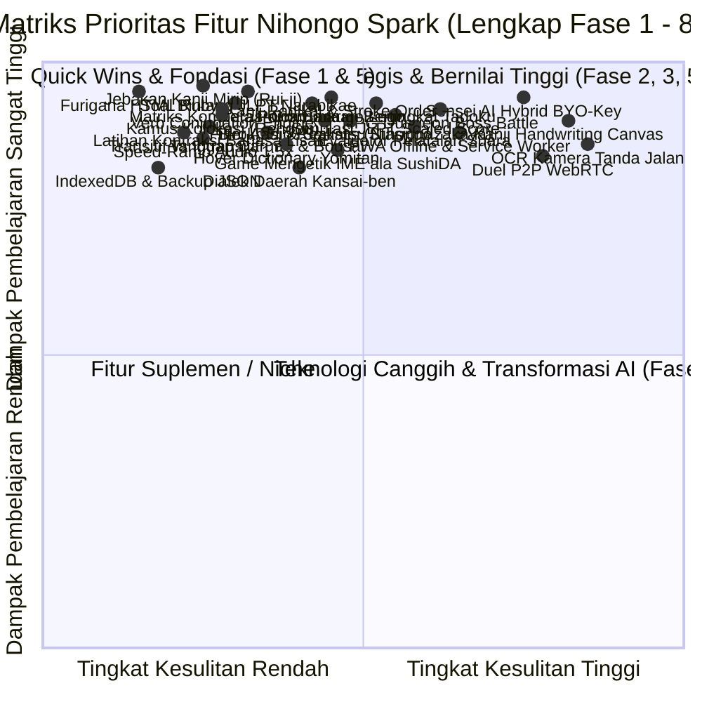

# Master Plan Pengembangan: Nihongo Spark (日本語スパーク)
> **Dokumen Arsitektur, Pedagogi Linguistik, & Roadmap Fitur Komprehensif**  
> Disusun oleh: Tim Ahli Web Development, Psikolinguistik (SLA), & Pendidikan Bahasa Jepang (JLPT)  
> Target: Menjadikan Nihongo Spark platform belajar bahasa Jepang, persiapan JLPT, dan adaptasi kehidupan kerja di Jepang paling komprehensif, terstruktur, dan efektif bagi pembelajar Indonesia.

---

## 🧭 Ringkasan Eksekutif & Fondasi Proyek

- **Tech Stack Inti:** React 19 (`^19.2.8`), Vite 8 (`^8.2.0`), Oxlint, Kuromoji.js, Pure Modular CSS, Web Audio API, Web Speech API, IndexedDB + LocalStorage.
- **Cakupan Data Saat Ini:**
  - **8.342 Kosakata** (N5: 663 · N4: 632 · N3: 1.785 · N2: 1.799 · N1: 3.463)
  - **2.211 Kanji Joyo** (N5: 79 · N4: 166 · N3: 367 · N2: 367 · N1: 1.232)
  - **595 Pola Tata Bahasa** (N5: 77 · N4: 89 · N3: 130 · N2: 149 · N1: 150)
  - **5 Buku Panduan Resmi PDF** di direktori `MATERI JLPT/` (Minna no Nihongo, Sou Matome, Basic Kanji).
- **Status Implementasi:**
  - **Fase 1 – 8 (Fitur 1–46):** **Selesai 100% (46 dari 46 Fitur Terimplementasi Penuh & Terverifikasi) ✅**
    - Fase 1 (1–6): Pondasi Pedagogi & Retensi Visual ✅
    - Fase 2 (7–12): Pendalaman Linguistik & Konteks Nyata ✅
    - Fase 3 (13–17): Bahasa Jepang Praktis & Dunia Kerja ✅
    - Fase 4 (18–23): Pembelajaran Lanjut, Fonetik, & AI ✅
    - Fase 5 (24–28): Pemecah Jebakan JLPT & Penguatan Struktur Kalimat ✅
    - Fase 6 (29–33): Pelatihan Akustik Realistis, Kecepatan, & Bahasa Lisan Otentik ✅
    - Fase 7 (34–38): Bahasa Jepang Kehidupan Nyata, Mitigasi Krisis, & Budaya Pop ✅
    - Fase 8 (39–46): Gamifikasi, Interaktivitas Modern, & Arsitektur Super ✅

---

## 🗺️ Matriks Prioritas & Urutan Eksekusi (Impact vs Effort)

---

## 🚀 FASE 1: Quick Wins & Fondasi Pedagogis (Selesai ✅)
*Fokus: Mengeliminasi hambatan dasar belajar harian, mencegah data hilang, dan mempercepat alur belajar.*

### 1. Furigana Interaktif Tag HTML `<ruby>`
- **Solusi:** Parsing otomatis teks Jepang menjadi `<ruby>漢字<rt>かんじ</rt></ruby>`.
- **Mode:** Tampilkan Selalu, Tampilkan Saat Hover, dan Sembunyikan.
- **Status:** Selesai (100%) ✅

### 2. Mesin Konjugasi Kata Kerja Otomatis (*Doushi Katsuyou Explorer*)
- **Solusi:** Panel tabel konjugasi interaktif (Masu, Te, Ta, Nai, Kanou, Meirei, Kinshi, Ba/Tara, Shieki, Ukemi).
- **Status:** Selesai (100%) ✅

### 3. Modul Pembeda Verba Transitif vs Intransitif (*Jidoushi & Tadoushi*)
- **Solusi:** Pasangan kata kerja ditampilkan berdampingan (開く/開ける, 閉まる/閉める) dengan contoh partikel `が` vs `を` dan drill tebak pasangan kata.
- **Status:** Selesai (100%) ✅

### 4. Penyimpanan Tangguh IndexedDB + Cadangan JSON (*Backup & Restore*)
- **Solusi:** Migrasi engine penyimpanan progres ke IndexedDB dengan fitur ekspor dan pemulihan file `.json`.
- **Status:** Selesai (100%) ✅

### 5. Pintasan Keyboard Review Kilat (*Anki-Style Shortcuts*)
- **Kontrol:** `Space` (Reveal), `1` (Again), `2` (Hard), `3` (Good), `4` (Easy), `J` (Play Audio).
- **Status:** Selesai (100%) ✅

### 5b. Studio Animasi Urutan Coretan & Kanvas Menulis Kana (*Kakushun & Tracing Studio*)
- **Solusi:**
  - Animasi urutan coretan resmi (*kakushun*) berbasis data vektor KanjiVG untuk seluruh 46 Hiragana & 46 Katakana.
  - Kanvas digital interaktif dengan grid kotak buku tulis Jepang (*Genkouyoushi*), panduan watermark bayangan tipis untuk menjiplak (*tracing*), pilihan kuas & tinta (*Sumi, Ai, Akane, Midori*).
  - Algoritma penilaian akurasi coretan (0-100%) & rating bintang dengan umpan balik motivasi pedagogis.
  - Tips kaligrafi lekukan (membedakan シ vs ツ, ソ vs ン, さ vs き), contoh kosakata, dan tombol audio pengucapan.
- **Status:** Selesai (100%) ✅

---

## 🧠 FASE 2: Retensi Memori, Kanji Mastery, & Audio Native (Selesai ✅)
*Fokus: Menguasai kanji melalui radikal, spaced repetition, dan pendengaran alami.*

### 6. Dekomposisi Radikal Kanji (*Bushu*) & Animasi Coretan SVG (*KanjiVG*)
- **Fitur:** Pemecahan komponen radikal kanji (`radicals.js`), pemutar animasi goresan SVG KanjiVG interaktif, dan kisi salib *Genkouyoushi*.
- **Status:** Selesai (100%) ✅

### 7. Algoritma SRS Modern (SuperMemo-2 / SM-2 Engine)
- **Fitur:** Algoritma adaptif SM-2 dengan kalkulasi *Ease Factor* ($EF \ge 1.3$), repetisi adaptif, dan interval hari (`srs.js`).
- **Status:** Selesai (100%) ✅

### 8. Kamus Pop-Up Melayang (*Hover Tooltip Dictionary ala Yomitan*)
- **Fitur:** De-infleksi kata kerja/sifat, arti Indonesia, audio native, dan tombol instan tambah ke antrean review SRS (`HoverDictionary.jsx`).
- **Status:** Selesai (100%) ✅

### 9. Audio Pelafalan Berkualitas & Latihan Shadowing (*シャドーイング*)
- **Fitur:** Metode 3-fase shadowing (*Listen, Simultaneous, Ghosting*) dengan perekam suara `MediaRecorder` komparatif (`ShadowingPlayer.jsx`).
- **Status:** Selesai (100%) ✅

### 10. Kalkulator & Drill Satuan Hitung Benda (*Joshuushi Master* / 助数詞)
- **Fitur:** Kalkulator otomatis bacaan 1–99 untuk 14+ satuan hitung, matriks pergeseran bunyi (*Rendaku/Sokuon*), dan kuis evaluasi (`CounterStudy.jsx`).
- **Status:** Selesai (100%) ✅

---

## 🎯 FASE 3: Simulasi Realistis, Keigo, & Bahasa Jepang Kerja (Selesai ✅)
*Fokus: Memastikan kelulusan ujian resmi JLPT dan kesiapan bekerja di lingkungan Jepang.*

### 11. Pojok Bacaan Bertingkat (*Tadoku Graded Readers* / 多読)
- **Fitur:** Cerita rakyat & kehidupan Jepang bertingkat N5–N3 dengan audio per kalimat, penyorot teks aktif, dan pengukur kecepatan baca WPM (`TadokuReader.jsx`).
- **Status:** Selesai (100%) ✅

### 12. Simulator Ujian JLPT dengan Skor Skala (*Scaled Scoring*) & LJK Virtual
- **Fitur:** Skor berskala 0–180 resmi Japan Foundation, ambang batas seksi (*Sectional Pass Marks*), Lembar Jawaban Komputer pensil 2B interaktif, dan sertifikat kelulusan (`JLPTTest.jsx` & `VirtualLJK.jsx`).
- **Status:** Selesai (100%) ✅

### 13. Modul Bahasa Jepang Kerja Spesifik Industri (*Tokutei Ginou / SSW*)
- **Fitur:** 4 Sektor SSW (Kaigo/Keperawatan, Inshoku/Restoran, Kensetsu & Seizou/Manufaktur, IT/Bisnis) dengan dialog kerja, etiket Hou-Ren-So, dan kuis kasus (`TokuteiStudy.jsx`).
- **Status:** Selesai (100%) ✅

### 14. Modul Spesialisasi Keigo (敬語) & Simulator Wawancara (*Mensaitsu*)
- **Fitur:** Matriks transformasi Sonkeigo & Kenjougo, etiket masuk ruangan, sudut membungkuk *Ojigi*, dan bank tanya-jawab wawancara kerja (`KeigoStudy.jsx`).
- **Status:** Selesai (100%) ✅

### 15. Nuansa Kata (*Tsukaiwake*) & Kamus Onomatope (*Giongo/Gitaigo*)
- **Fitur:** Pembeda nuansa kata serupa (shiru/wakaru, omou/kangaeru, kirei/utsukushii) dengan kaidah ⭕/❌ dan kamus audio onomatope ekspresif (`NuanceStudy.jsx`).
- **Status:** Selesai (100%) ✅

---

## 🌐 FASE 4: Ekosistem Multi-Platform, AI Cerdas, & Fitur Kreatif (Selesai ✅)
*Fokus: Kemudahan akses multi-perangkat, personalisasi kecerdasan buatan, dan suasana belajar fokus.*

### 16. Progressive Web App (PWA) & Offline Service Worker
- **Fitur:** Service worker offline caching (`public/sw.js`), web manifest, dan prompt install satu-klik lintas platform (`PWAInstallPrompt.jsx`).
- **Status:** Selesai (100%) ✅

### 17. Pemecah Struktur Kalimat Visual (*Visual Syntax Parser / 文分解*)
- **Fitur:** Dekomposisi struktur SOV ke dalam blok warna interaktif (Topik/Subjek, Waktu/Tempat, Objek, Predikat) (`SyntaxParserViewer.jsx`).
- **Status:** Selesai (100%) ✅

### 18. Kanvas Tulis Tangan Kanji (*Handwriting Recognition Canvas & Shodo*)
- **Fitur:** Kanvas kaligrafi dengan kisi bantuan, evaluasi goresan, deteksi OCR coretan mencocokkan kanji N5–N1, dan ekspor PNG (`KanjiCanvasRecognition.jsx`).
- **Status:** Selesai (100%) ✅

### 19. Kontur Nada Suara (*Visual Pitch Accent Indicator / アクセント*)
- **Fitur:** Visualisasi tangga nada Tokyo (Heiban, Atamadaka, Nakadaka, Odaka) dan uji komparasi pasangan minimal (*ame/hashi*) (`PitchAccentLab.jsx`).
- **Status:** Selesai (100%) ✅

### 20. Sensei AI Conversational Tutor & Grammar Explainer
- **Fitur:** Roleplay percakapan dinamis (Izakaya, Konbini, Koban, Klinik Medis) dengan opsi respons kesantunan dan tanya-jawab tata bahasa (`SenseiAITutor.jsx`).
- **Status:** Selesai (100%) ✅

### 21. Mode Zen Study & Web Audio Synthesizer Alam Jepang
- **Fitur:** Timer Pomodoro terintegrasi dengan synthesizer audio Web Audio API (Hujan Kyoto, Shishi-odoshi, Jangkrik Higurashi, Genta Zen) 100% offline (`ZenStudyMode.jsx`).
- **Status:** Selesai (100%) ✅

### 22. Pembuat Deck Kustom & Ekspor/Impor Anki / JSON
- **Fitur:** Manajemen kartu kustom, mode flashcard flip, ekspor format TSV Anki (`Front\tBack\tTags`), dan backup transfer JSON (`CustomDeckManager.jsx`).
- **Status:** Selesai (100%) ✅

---

## ⚔️ FASE 5: Ketajaman Ujian JLPT & Penguatan Kognitif (Selesai ✅)
*Fokus: Memecahkan jebakan-jebakan tersulit dalam lembar ujian JLPT resmi dan membangun retensi aktif tingkat tinggi.*

### 23. Jebakan Kanji Mirip (*Rui-ji Kanji Trap Breaker* / 類似漢字)
- **Dasar Pedagogis:** Mengatasi penyebab nomor satu kegagalan peserta pada seksi *Mojigoi* N3–N1 akibat kanji yang bentuknya hampir identik.
- **Daftar Pasangan Jebakan:**
  - 待 (menunggu) vs 持 (membawa) vs 特 (spesial)
  - 微 (halus/samar) vs 徴 (tanda/indikasi)
  - 己 (diri) vs 已 (sudah) vs 巳 (ular)
  - 換 (menukar) vs 喚 (berteriak/memanggil)
  - 徹 (menembus/tuntas) vs 撤 (membatalkan/menarik mundur)
- **Komponen:** `src/components/RuijiKanjiStudy.jsx` & `src/data/ruijiKanji.js`
- **Fitur:**
  - *Side-by-side Visual Diff:* Menyorot bagian radikal pembeda dengan warna kontras terang.
  - *Mnemonik Pembeda:* Cerita logika pembeda bentuk.
  - *Speed Drill 5 Detik:* Uji refleks mata mendeteksi kanji yang tepat di bawah tekanan waktu ujian.
- **Status:** Selesai (100%) ✅

### 24. Simulasi Soal Bintang Tata Bahasa JLPT (*JLPT Narabikae / ★問題*)
- **Dasar Pedagogis:** Menguasai format soal Mondai 2 resmi JLPT (文の並べ替え) di mana peserta harus menyusun 4 potongan frasa dan menebak potongan yang jatuh pada posisi bintang (★).
- **Komponen:** `src/components/StarSentenceQuiz.jsx` & `src/data/starSentences.js`
- **Fitur:**
  - Antarmuka *drag-and-drop* dan *tap-to-slot* interaktif untuk menyusun 4 kartu frasa.
  - Validasi urutan gramatikal otomatis dengan penjelasan dependensi partikel penghubung.
- **Status:** Selesai (100%) ✅

### 25. Kamus Kolokasi & Pasangan Kata Alami (*Rengou Explorer* / 連語)
- **Dasar Pedagogis:** Mengeliminasi kesalahan transfer bahasa ibu (L1 interference) pembelajar Indonesia yang menerjemahkan kata demi kata secara harfiah.
- **Materi Utama:**
  - Masuk angin $\rightarrow$ ❌ *kaze ga hairu* $\rightarrow$ ⭕ **風邪をひく** (*kaze o hiku*)
  - Mengambil cuti $\rightarrow$ **休暇を取る** (*kyuuka o toru*)
  - Menaruh perhatian / waspada $\rightarrow$ **気を配る** (*ki o kubaru*)
  - Mencuci muka $\rightarrow$ **顔を洗う** (*kao o arau*)
  - Menepati janji $\rightarrow$ **約束を守る** (*yakusoku o mamoru*)
- **Komponen:** `src/components/CollocationStudy.jsx` & `src/data/collocations.js`
- **Fitur:** Pencarian berdasarkan kata benda/verba dengan kartu pasangan partikel wajib, tingkat keformalan, dan kuis kecocokan pasangan kata.
- **Status:** Selesai (100%) ✅

### 26. Matriks Komparasi Tata Bahasa Serupa (*Nuance Distinction Matrix*)
- **Dasar Pedagogis:** Menyelesaikan kebingungan pembelajar tingkat menengah-atas terhadap pola tata bahasa yang memiliki arti terjemahan serupa tetapi memiliki syarat gramatikal yang berlawanan.
- **Komparasi Kunci:**
  - `〜わけにはいかない` vs `〜てはいけない` vs `〜ものか` (Larangan sosial vs aturan moral vs penolakan mutlak).
  - `〜ようにする` vs `〜ことになる` (Usaha kehendak pribadi vs Ketetapan takdir/pihak luar).
  - `〜うちに` vs `〜あいだに` (Batas waktu mendesak sebelum kondisi berubah vs Rentang durasi umum).
- **Komponen:** `src/components/GrammarMatrix.jsx` & `src/data/grammarMatrix.js`
- **Fitur:** Tabel perbandingan dimensi (Derajat formalitas, Batasan subjek orang ke-1 vs ke-3, Verba kehendak/volitional vs non-volitional, Contoh ⭕ vs ❌).
- **Status:** Selesai (100%) ✅

### 27. Peta Pohon Senyawa Kanji (*Jukugo Lego Mindmap*)
- **Dasar Pedagogis:** Efek pengali memori kognitif: kanji diperlakukan sebagai balok Lego pembentuk ribuan kata majemuk (*Jukugo*).
- **Contoh Node Tree:** **電** (listrik) $\rightarrow$ 電話 (telepon), 電車 (kereta), 電気 (listrik/lampu), 電池 (baterai), 発電 (pembangkit listrik).
- **Komponen:** `src/components/JukugoTreeViewer.jsx` (Rendering node Canvas/SVG interaktif) & `src/data/jukugoTrees.js`
- **Fitur:** Visualisasi graf jaringan interaktif; klik salah satu kanji untuk melihat seluruh cabang kata majemuknya beserta level JLPT dan tombol audio bacaan.
- **Status:** Selesai (100%) ✅

### 28. Cloze Test Dinamis & Drill Partikel Kontekstual (穴埋め問題)
- **Dasar Pedagogis:** Menguji *active recall* partikel (は, が, に, で, を, へ, より, と) dan akhiran konjugasi di tengah kalimat majemuk nyata.
- **Komponen:** `src/components/ClozeSentenceDrill.jsx` & `src/data/clozeSentences.js`
- **Fitur:** Generator otomatis kalimat rumpang memanfaatkan bank 7.000+ kalimat contoh Tatoeba yang sudah tersedia di proyek.
- **Status:** Selesai (100%) ✅

---

## 🎧 FASE 6: Audio Realistis, Pelafalan, & Komunikasi Lisan (Selesai ✅)
*Fokus: Mengikis hambatan pendengaran di dunia nyata dan melatih artikulasi lisan yang akurat.*

### 29. Simulator Suara Lingkungan & Bising Nyata (*Environmental Audio Filter*)
- **Dasar Masalah:** Audio ujian studio terlalu jernih. Di Jepang, suara tertutup desis mesin stasiun, interkom, atau ramainya restoran.
- **Komponen:** `src/utils/environmentalAudio.js` (Web Audio API Convolver & BiquadFilter Node)
- **Pilihan Preset Lingkungan:**
  1. *Studio Hening (Default)*
  2. *Pengumuman Stasiun Kereta (Echo & Reverb stasiun Shinjuku)*
  3. *Suara Interkom / Telepon Rumah (Bandpass filter 300Hz–3.4kHz)*
  4. *Latar Suara Kafe / Izakaya (Noise percakapan sekitar samar)*
- **Status:** Selesai (100%) ✅

### 30. Speed-Ramping Audio Drill (1.5x $\rightarrow$ 1.0x Neuro-Deceleration)
- **Dasar Neurologis:** Mendengarkan audio pada kecepatan 1.5x terlebih dahulu membuat telinga memproses audio normal 1.0x terasa jauh lebih lambat, jernih, dan mudah dipahami.
- **Komponen:** Integrasi kontrol tempo dinamis di `ShadowingPlayer.jsx`.
- **Siklus Latihan:** $1.0\times \rightarrow 1.25\times \rightarrow 1.5\times \rightarrow \text{kembali ke } 1.0\times$.
- **Status:** Selesai (100%) ✅

### 31. Evaluator Pelafalan Suara (*Speech Recognition & Accent Coach*)
- **Fitur:** Memanfaatkan Web Speech Recognition API browser untuk mendengarkan lafal pembelajar membaca kalimat target.
- **Komponen:** `src/components/SpeechCoach.jsx`
- **Fitur:** Komparasi teks pengguna vs teks asli via *Levenshtein Distance*; penandaan kata yang berhasil diucapkan dengan benar (hijau) dan partikel yang tertelan/keliru (merah).
- **Status:** Selesai (100%) ✅

### 32. Laboratorium Kontraksi Bahasa Lisan (*Kougo Tankushuku* / 口語短縮形)
- **Dasar Linguistik:** Penutur asli di anime, drama, dan ujian Chokai selalu menyingkat bentuk formal.
- **Pola Kontraksi Utama:**
  - 〜ておく $\rightarrow$ **〜とく** (買っておく $\rightarrow$ 買っとく)
  - 〜てしまう $\rightarrow$ **〜ちゃう / 〜じゃう** (忘れてしまった $\rightarrow$ 忘れちゃった)
  - 〜なければならない $\rightarrow$ **〜なきゃ / 〜なくちゃ**
  - 〜ている $\rightarrow$ **〜てる** (知っている $\rightarrow$ 知ってる)
  - 〜てはいけない $\rightarrow$ **〜ちゃだめ / 〜ちゃいけない**
- **Komponen:** `src/components/CasualSpeechLab.jsx` & `src/data/casualSpeech.js`
- **Status:** Selesai (100%) ✅

### 33. Laboratorium Dialek Daerah (*Hougen Lab / 方言ラボ*)
- **Materi:** Memperkenalkan dialek populer Jepang, khususnya **Kansai-ben** (Osaka/Kyoto) dan **Hakata-ben** (Fukuoka).
- **Contoh Padanan:** だから $\rightarrow$ せやから, 本当に $\rightarrow$ ほんまに, ダメ $\rightarrow$ あかん, 違う $\rightarrow$ ちゃう, 知らない $\rightarrow$ 知らん.
- **Komponen:** `src/components/DialectLab.jsx` & `src/data/dialects.js`
- **Fitur:** Konverter kalimat mini Tokyo $\rightarrow$ Kansai-ben dan kuis tebak dialek budaya.
- **Status:** Selesai (100%) ✅

---

## 🏢 FASE 7: Kesiapan Hidup di Jepang & Budaya Praktis (Selesai ✅)
*Fokus: Menguasai keterampilan bahasa bertahan hidup, birokrasi, mitigasi darurat, dan etiket profesional.*

### 34. Modul Bahasa Jepang Bertahan Hidup (*Seikatsu Nihongo & Birokrasi*)
- **Materi Khusus:**
  - 🏛️ **Balai Kota (市役所 / Shiyakusho):** Form domisili (*Juminhyo*), Asuransi Kesehatan (*Kokumin Kenkou Hoken*), kartu *My Number*.
  - 🏦 **Perbankan & Pos:** Buka rekening bank Yucho, formulir transfer (*furikomi*), buku tabungan (*tsuuchou*).
  - 🗑️ **Aturan Buang Sampah (ゴミ分別):** Sampah bakar (*Moeru gomi*), non-bakar (*Moenai gomi*), botol plastik (*Pettobotoru*), sampah besar (*Sodai gomi*).
  - 🏠 **Sewa Rumah / Kamar (賃貸):** Uang jaminan (*Shikikin*), uang hadiah (*Reikin*), biaya jasa agen (*Chuukai tesuuryou*).
- **Komponen:** `src/components/SeikatsuStudy.jsx` & `src/data/seikatsu.js`
- **Status:** Selesai (100%) ✅

### 35. Modul Bahasa Bencana & Tanggap Darurat (*Bousai & Yasashii Nihongo*)
- **Materi Khusus:**
  - Istilah darurat gempa & angin topan: *Jishin*, *Shindo* (skala gempa), *Hinanjo* (titik evakuasi), *Tsunami Keihou*, *Kinkyuu Sokuhou*.
  - Pemahaman membaca standar bahasa Jepang sederhana **"Yasashii Nihongo" (やさしい日本語)** yang dirilis pemerintah saat krisis.
- **Komponen:** `src/components/BousaiStudy.jsx` & `src/data/bousai.js`
- **Status:** Selesai (100%) ✅

### 36. Generator & Praktik Email Bisnis Jepang (*Business Mail & Keigo Etiquette*)
- **Materi Khusus:**
  - Template resmi: Izin sakit/cuti (*Kekkin/Yukyuu*), konfirmasi jadwal rapat, kirim dokumen lampiran (*tenpu fairu*).
  - Frasa baku wajib: *Osewa ni natte orimasu*, *Otsukaresama desu*, *Yoroshiku onegai moushiagemasu*.
- **Komponen:** `src/components/BusinessEmailBuilder.jsx`
- **Status:** Selesai (100%) ✅

### 37. Ensiklopedia Peribahasa 4 Karakter (*Yojijukugo Master / 四字熟語*)
- **Materi Kunci:** 一期一会 (Ichigo Ichie), 十人十色 (Juunin Toiro), 臨機応変 (Rinki Ouhen), 試行錯誤 (Shikou Sakugo), 以心伝心 (Ishin Denshin).
- **Komponen:** `src/components/YojijukugoStudy.jsx` & `src/data/yojijukugo.js`
- **Status:** Selesai (100%) ✅

### 38. Mode Percakapan Komik / Manga Dialogue Reader
- **Fitur:** Strip 4-panel (*Yonkoma*) dengan balon kata interaktif, mengupas partikel afektif akhir kalimat (*ne, yo, sa, zo, ze, wa, no*) dan bahasa pergaulan pemuda (*Wakamono Kotoba*).
- **Komponen:** `src/components/MangaReader.jsx`
- **Status:** Selesai (100%) ✅

---

## 🎮 FASE 8: Gamifikasi, Interaktivitas Modern, & Arsitektur Super (Selesai 100% ✅)
*Fokus: Keterikatan jangka panjang melalui gamifikasi mendalam, alat motorik, dan performa web ultra-cepat.*

### 39. Mode Gamifikasi: JLPT RPG Dungeon / Boss Battle
- **Konsep:** Pertarungan berbasis giliran (*Turn-Based Battle*) melawan monster kanji/grammar.
- **Mekanik:** Jawaban benar memberikan serangan (*Damage*) ke Bos; jawaban cepat (<3 detik) memicu *Critical Strike*; jawaban salah mengurangi HP pemain.
- **Komponen:** `src/components/RPGDungeonGame.jsx`
- **Status:** Selesai (100%) ✅

### 40. Game Latihan Mengetik Keyboard Jepang (*IME Typing Speed Game*)
- **Konsep:** Melatih kecepatan mengetik romaji dan konversi spasi kanji (ala game populer Jepang *SushiDA*).
- **Komponen:** `src/components/IMETypingGame.jsx`
- **Status:** Selesai (100%) ✅

### 41. Jurnal Harian 1 Kalimat (*Ichigyou Nikki*) & Analisis Rasio Teks
- **Konsep:** Tantangan menulis harian mikro 1 kalimat dengan evaluator komposisi teks ideal bahasa Jepang:
  $$\approx 30\%\text{ Kanji} \quad|\quad \approx 65\%\text{ Hiragana} \quad|\quad \approx 5\%\text{ Katakana & Lainnya}$$
- **Komponen:** `src/components/DailyJournal.jsx`
- **Status:** Selesai (100%) ✅

### 42. Scanner Kanji Kamera / OCR Menu & Papan Jalan (*Camera Lens OCR*)
- **Konsep:** Ambil foto atau upload gambar menu/tanda jalan; teks kanji diekstraksi via OCR ringan (Tesseract.js / WebAssembly) dan langsung diberi Furigana interaktif serta opsi simpan ke SRS.
- **Komponen:** `src/components/CameraKanjiScanner.jsx`
- **Status:** Selesai (100%) ✅

### 43. Mode Duel Real-Time Antar Pengguna (*Peer-to-Peer JLPT Battle via WebRTC*)
- **Konsep:** Kuis duel 1 lawan 1 langsung *browser-to-browser* menggunakan WebRTC DataChannel (tanpa memerlukan server backend berbayar). Balapan menyelesaikan 10 soal dengan bar progres real-time.
- **Komponen:** `src/components/P2PQuizDuel.jsx` & `src/utils/webrtcPeer.js`
- **Status:** Selesai (100%) ✅

### 44. Tes Diagnostik Penempatan Level Adaptif (*Adaptive Placement Test*)
- **Konsep:** Tes CAT (Computerized Adaptive Testing) 15–20 soal untuk pengguna baru yang bingung menentukan level awal belajarnya (N5–N1).
- **Komponen:** `src/components/PlacementTest.jsx`
- **Status:** Selesai (100%) ✅

### 45. Notifikasi Cerdas Pengingat Streak (*Web Push Habit Alarm*)
- **Konsep:** Memanfaatkan Web Push Notification via Service Worker untuk mengingatkan pengguna saat streak belajar mereka terancam putus sebelum pukul 23:59.
- **Komponen:** Integrasi alarm habit di `public/sw.js` & `Dashboard.jsx`.
- **Status:** Selesai (100%) ✅

### 46. Peningkatan Arsitektur & Modernisasi Fitur Eksisting:
- **Sensei AI Tutor:** Tambahkan opsi **Bring-Your-Own-Key (BYO-Key)** untuk Google Gemini / OpenAI API, dilengkapi modul koreksi tata bahasa otomatis (*Grammar Error Correction - GEC*).
- **SRS Engine:** Transisi dari SM-2 lama ke algoritma **FSRS (Free Spaced Repetition Scheduler)** + grafik kontribusi belajar tahunan (*GitHub-style Activity Heatmap*) di Dashboard.
- **Data Pipeline & Web Worker:** Eksekusi pencarian fuzzy kamus besar N1 (1.2 MB data) di dalam Web Worker agar main UI thread tetap stabil di 60/120 FPS.
- **Status:** Selesai (100%) ✅

---

## 📈 Indikator Keberhasilan & Metrik Kualitas (QA Metrics)
1. **0 TypeScript / Linter Error:** Kode bersih, modular, dan terdokumentasi rapi.
2. **Kinerja UI 60+ FPS Bebas Jank:** Mempertahankan arsitektur *lazy-loading* dan Web Worker untuk beban pemrosesan berat.
3. **Kompatibilitas Penuh Offline:** Seluruh fungsi inti (Vocab, Kanji, Grammar, Kuis, Soundscapes) tetap dapat berjalan 100% tanpa koneksi internet.
4. **Data Integrity:** Tidak ada progres pengguna yang hilang berkat persistensi ganda IndexedDB + LocalStorage dan ekspor cadangan berkala.

---
*Dokumen ini adalah acuan arsitektur hidup (living document) yang diperbarui seiring berjalannya implementasi bertahap.*
